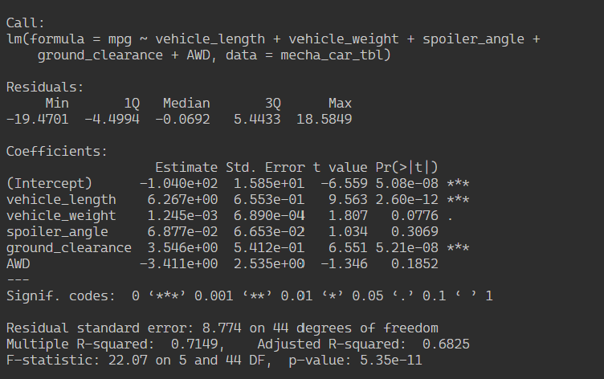

# MechaCar Analysis

## Linear Regression to Predict MPG

According to the linear regresson analysis of the MechCar data, the following variables provided a non-random amount of variance to the MPG values:

* vehicle_length (significant at the 0.001 level)
* ground_clearance (significant at the 0.001 level)

In other words, vehicle length and ground clearance have a significant impact on MPG. The Intercept was also significant at the 0.001 level, indicating there are other factors not included in our model that are affecting MPG of the MechaCar. The Pearson's Correlation Coefficient (r-squared) value was 0.71, indicating a strong correlation. The slope of the linear model is not considered to be zero because there is a significant linear relationship between the dependent variable (MPG) and two independent variables. This model does appear to predict MPG of MechaCar prototypes effectively; however, we have to note that due to the lack of significant variables overall may be evidence of overfitting. 

## Summary Statistics on Suspention Coils

MechaCar design specifications require that variance of the suspension coils must not exceed 100 pounds per square inch. We ran summary statistics on the Suspension_Coil data; here is what we found:

* In total, the variance did not exceed 100 lbs/sq in. In the chart below, you can see the total variance is 62.29.

* However, the variance did exceed 100 lbs/sq in in Lot 3, where variance stood at 170.29.

