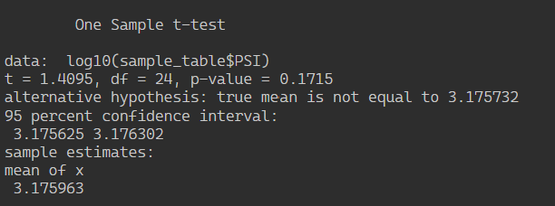
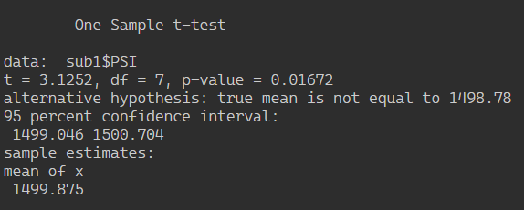
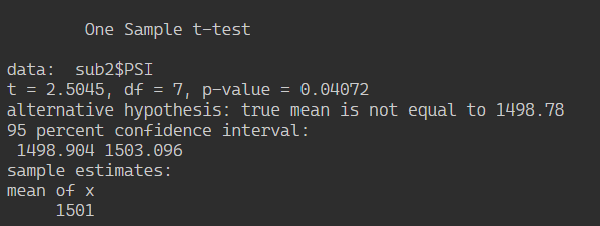
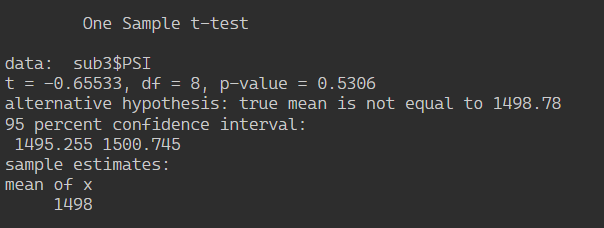

# MechaCar Analysis

## Linear Regression to Predict MPG

According to the linear regresson analysis of the MechCar data, the following variables provided a non-random amount of variance to the MPG values:

* vehicle_length (significant at the 0.001 level)
* ground_clearance (significant at the 0.001 level)

In other words, vehicle length and ground clearance have a significant impact on MPG. The Intercept was also significant at the 0.001 level, indicating there are other factors not included in our model that are affecting MPG of the MechaCar. The Pearson's Correlation Coefficient (r-squared) value was 0.71, indicating a strong correlation. The slope of the linear model is not considered to be zero because there is a significant linear relationship between the dependent variable (MPG) and two independent variables. This model does appear to predict MPG of MechaCar prototypes effectively; however, we have to note that due to the lack of significant variables overall may be evidence of overfitting. 

## Summary Statistics on Suspension Coils

MechaCar design specifications require that variance of the suspension coils must not exceed 100 pounds per square inch. We ran summary statistics on the Suspension_Coil data; here is what we found:

* In total, the variance did not exceed 100 lbs/sq in. In the table below, you can see the total variance is 62.29.

* However, the variance did exceed 100 lbs/sq in in Lot 3, where variance stood at 170.29.

## T-tests on Suspension Coils

The t-test conducted on the suspension coil PSI data came back with a p-value of 0.1715, which is larger than our assumed significance level 0f 0.05, indicating that we cannot reject the null hypthesis that there is no statistical difference in PSI across manufacturing lots. 

The t-test results for Lot 1 suspension coils indicates that there is a statistical difference in PSI values for coils in Lot 1 due to a p-value lower than our assumed significance level.

The t-test results for Lot 2 suspension coils indicates that there is a statistical difference in PSI values for coils in Lot 2 due to a p-value lower than our assumed significance level.

The t-test results for Lot 3 suspension coils indicates there is not a statistical difference in PSI values for coils in Lot 3 due to a p-value higher than our assumed significance level.

It is unclear at this time why suspension coils sampled from Lots 1 and 2 produced p-values that would support a statistical diffence in PSI values relative to the entire population and yet the t-test for the the whole data set indicated no statistical difference in PSI values across all manufacturing lots. More research is necessary.

## Study Design: MechaCar vs Competition

Obviously, we would like to know how our MechaCar will stand up against our competition. To that end, we have designed a statistical test that would provide insight into this topic. In today's economy, most consumers are hyper aware of gas prices. People are paying more attention to fuel efficiency and making purchasing decisions based on that metric. Though we have designed MechaCar to be a fun and enjoyable car to drive, we want to be sure we are not forgetting about consumers' concerns about fuel efficiency and the price they pay at the pump.

The metric we would test is fuel efficiency. The null hypothesis in our study would state that there is no statistical difference between two observed sample means, one for MechaCar and the other for a competitor. We want to be able to say that, at the very least, MechaCar's fuel efficiency is on par with our competitors. We would implement a Two-Sample t-test to discover if we could reject or fail to reject our null hypothesis. The Two-Sample t-test would be the most apropos statistical test to use for our project, as it compares the means of two samples to see if they are statistically different. In order to conduct this study, we will need fuel efficiency data, preferabley in miles per gallon (MPG) for MechaCar and for our competitors.